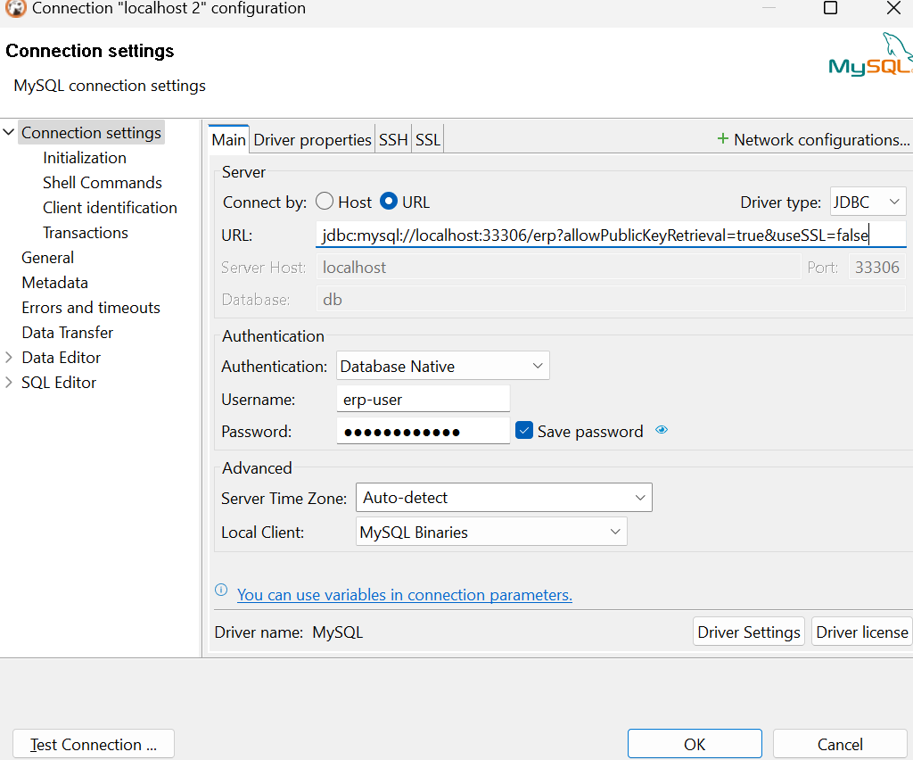
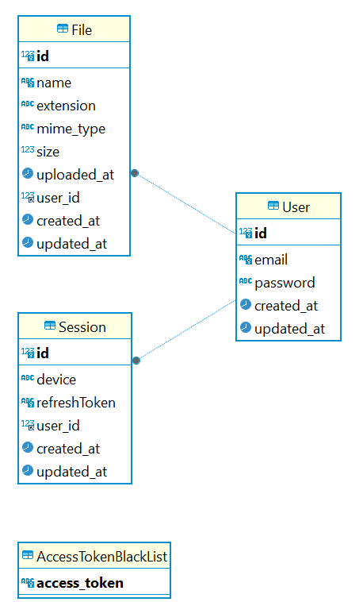

# ERP Restful API

Launch instruction

1. Enter the command to up the local MySQL

```sh
docker compose up -d
```

2. Enter the command to install all dependencies

```sh
npm i
```

3. Enter the command to launch all SQL migrations to prepare database structure

```sh
npm run prisma:migrate:dev
```

3. Create *.env* file from *.env.example*. Credentials from example file is valid for local start

4. Enter the command to launch the application

```sh
npm run dev
```

5. To connect to local database via DBeaver you should enter the following URL Connection string

```
jdbc:mysql://localhost:33306/erp?allowPublicKeyRetrieval=true&useSSL=false
```

Users credentials are stored in .env.example file

The example of database connection settings is below



Example of Postman collection can find [here](./docs/erp-restful-api.postman_collection.json)

Database ERD is below

